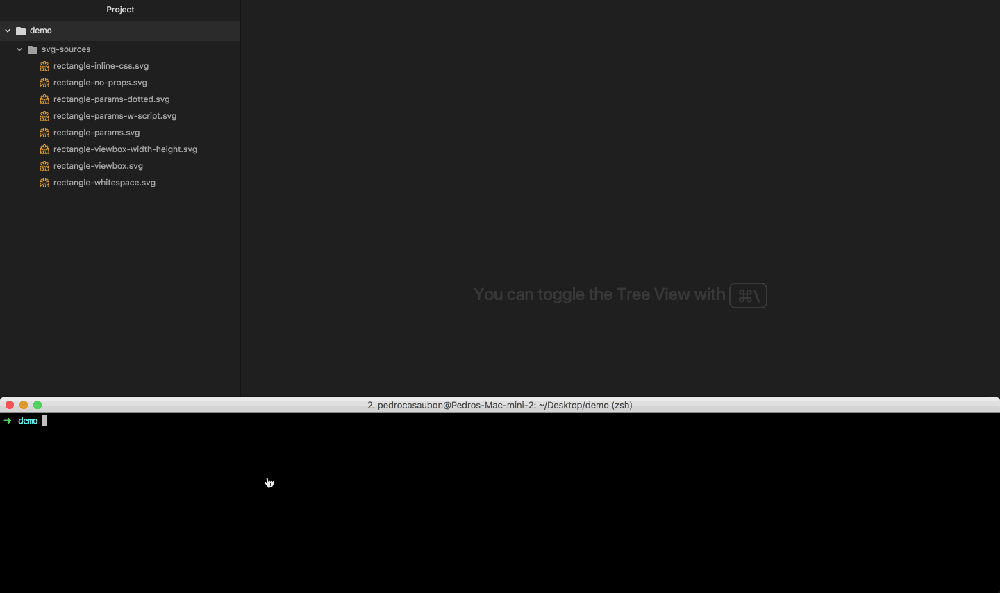

# svg2ts

Convert Standard SVG / Parameterized* SVG to TypeScript code / Angular components.



### Installation

```
npm install svg2ts -g
```

### Usage

```
svg2ts Usage:

  --input ./svg           svg source dir
  --output ./svg-ts-out   ts output dir
  --blueprint typescript  blueprint to use 'typescript'[default] 'angular'
  --module svg-to-ts      Module name for angular blueprint
```

### Overview

This tool converts SVGs to a TypeScript representation. The tool accepts 2 kinds of svg files:

* Standard SVG.
* Parameterized SVG (with custom template notation).

For example this svg: (rectangle-viewbox-width-height.svg)
```xml
<svg xmlns="http://www.w3.org/2000/svg" width="101" height="101" viewBox="0 0 100 100">
    <rect x="0" y="0" width="100" height="100" fill="#f00"/>
</svg>

```

Will be converted to this Typescript code:

```typescript
export const RectangleViewboxWidthHeight = {
  width: 101,
  height: 101,
  viewBox: { minx: 0, miny: 0, width: 100, height: 100 },
  name: 'rectangle-viewbox-width-height',
  svg: '<rect class="blue" x="0" y="0" width="100" height="100" fill="#f00"/>'
};

```

### Parameterized SVGs

If you need to parameterize some properties/values of the svg, svg2ts will look for any parameter inside the svg with the following notation:

```
{{defaultvalue|variableName}}
```

For example, if we process this svg:
```xml
<svg xmlns="http://www.w3.org/2000/svg" width="101" height="101" viewBox="0 0 100 100">
    <rect fill="{{#f00|fill}}" x="{{0|x}}" y="{{0|y}}" width="{{100|width}}" height="{{100|height}}"/>
</svg>
```

we get this ouput:

```typescript
export interface ParameterizedContext {
  uuid?: number;
  fill?: string;
  x?: number;
  y?: number;
  width?: number;
  height?: number;
}
export const Parameterized = {
  width: 101,
  height: 101,
  viewBox: { minx: 0, miny: 0, width: 100, height: 100 },
  name: 'parameterized',
  svg:
    '<rect fill="{{fill}}" x="{{x}}" y="{{y}}" width="{{width}}" height="{{height}}"/>',
  contextDefaults: { fill: '#f00', x: 0, y: 0, width: 100, height: 100 }
};

```

The svg output template will have the final replacement keys while the default values will be exported to the contextDefaults property.

It will also autogenerate an interface of the parameterized values.

#### Parametrized SVG inline css

We can also parameterize the values **from the inline style tags** in the svg.

The styles found there will be "namespaced" with a uuid variable to prevent global conflicts.

Before:

```css
.blueFill { fill: #00f }
```

After:

```css
.svg-to-ts-{{uuid}} .blueFill { fill: #00f }
```

### Angular output

**svg2ts** can also autogenerate an Angular module.

To do this use the Angular blueprint option in the command line:

```
> svg2ts -i ./source ./dest --blueprint angular --module ng2-module-name
```

You can also pass a module name with the --module option.

The generated output will consist of:

* An Angular **module** file
* An **assets directory** with the normal typescript output
* A **components** directory containing the generated parameterized svg's Angular Components
* A specific svg icon component related to this module

### Angular output module usage

Assuming we have used the default --module option name that is **svg-to-ts**

Import the module inside your app module.

```typescript
@NgModule({
  ...
  imports: [..., SvgToTsModule]
  ...
})
export class AppModule {}
```

Then we can use it in our templates as:

##### For static SVG's

```xml
<svg-to-ts-svg [icon]="'rectangle-viewbox-width-height'"></svg-to-ts-svg>
```

Where [icon] is the kebab case name of the original svg file. This relation comes from this output:

```typescript
export const RectangleViewboxWidthHeight = {
  ...
  name: 'rectangle-viewbox-width-height'
  ...
};
```

##### For Parametrized SVG's

```xml
<svg-to-ts-svg [icon]="'parameterized'"></svg-to-ts-svg>
<svg-to-ts-svg [icon]="'parameterized'" [context]="customParamsObject"></svg-to-ts-svg>
```

Where [icon] is the kebab case name of the original parameterized svg file and [context] the target values that will be used to dynamically update the svg.

parameterized.svg

```xml
<svg xmlns="http://www.w3.org/2000/svg" width="101" height="101" viewBox="0 0 100 100">
    <rect fill="{{#f00|fill}}" x="{{0|x}}" y="{{0|y}}" width="{{100|width}}" height="{{100|height}}"/>
</svg>
```

Inside main angular app Template
```xml
<svg-to-ts-svg [icon]="'parameterized'" [context]="customParamsObject"></svg-to-ts-svg>
</svg>
```

Somewhere in the main Angular component

```
...
this.customParamsObject = { x:20, y:30, width:50, height:30, fill:'#FF0' };
...
```

## License

This project is licensed under the MIT License - see the [LICENSE.md](LICENSE.md) file for details.
