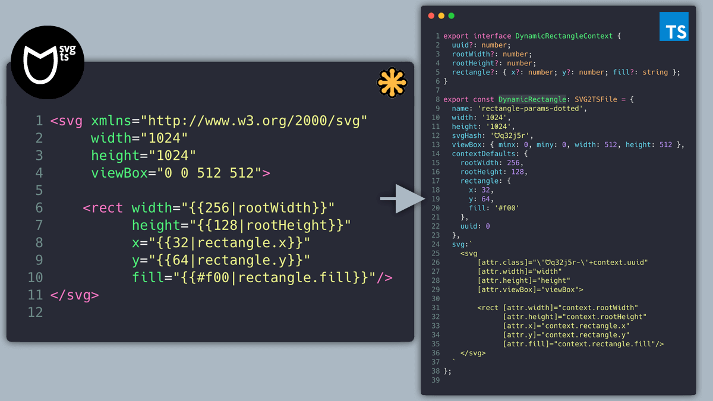
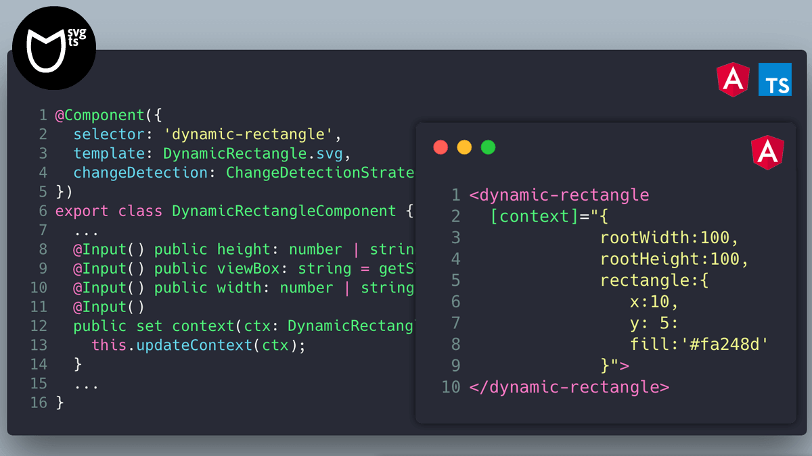

# svg2ts

## Convert Standard SVG / Parameterized\* SVG to TypeScript code / Angular components.




### Installation

```
npm install svg2ts -g
```

### Usage

```
svg2ts Usage:

  --input ./svg           svg source dir
  --output ./svg-ts-out   ts output dir
  --blueprint typescript  blueprint to use 'typescript'[default] 'angular'
  --module svg-to-ts      Module name for angular blueprint
  --config svg2ts.json    Use an external config file
```

### Overview

This tool converts SVGs to a TypeScript representation. The tool accepts 2 kinds of svg files:

- Standard SVG.
- Parameterized SVG (with custom template notation).

For example this svg: (rectangle-viewbox-width-height.svg)

```xml
<svg xmlns="http://www.w3.org/2000/svg" width="101" height="101" viewBox="0 0 100 100">
    <rect x="0" y="0" width="100" height="100" fill="#f00"/>
</svg>

```

Will be converted to this Typescript code:

```typescript
export const RectangleViewboxWidthHeight = {
  width: 101,
  height: 101,
  svgHash: 'ᗢ5n9aqp',
  viewBox: { minx: 0, miny: 0, width: 100, height: 100 },
  name: 'rectangle-viewbox-width-height',
  svg: '<rect class="blue" x="0" y="0" width="100" height="100" fill="#f00"/>'
};
```

### Parameterized SVGs

If you need to parameterize some properties/values of the svg, svg2ts will look for any parameter inside the svg with the following notation:

```
{{defaultvalue|variableName}}
```

For this svg:

```xml
<svg xmlns="http://www.w3.org/2000/svg" width="101" height="101" viewBox="0 0 100 100">
    <rect fill="{{#f00|fill}}" x="{{0|x}}" y="{{0|y}}" width="{{100|width}}" height="{{100|height}}"/>
</svg>
```

We will get this ouput:

```typescript
export interface ParameterizedContext {
  uuid?: number;
  fill?: string;
  x?: number;
  y?: number;
  width?: number;
  height?: number;
}

export const Parameterized = {
  width: 101,
  height: 101,
  svgHash: 'ᗢ5n9aqp',
  viewBox: { minx: 0, miny: 0, width: 100, height: 100 },
  name: 'parameterized',
  svg: '<rect fill="{{fill}}" x="{{x}}" y="{{y}}" width="{{width}}" height="{{height}}"/>',
  contextDefaults: { fill: '#f00', x: 0, y: 0, width: 100, height: 100 }
};
```

The svg output template will have the final replacement keys while the default values will be exported to the contextDefaults property.

It will also autogenerate an interface of the parameterized values.

### Isolation

Svg id's and css styles will be namespaced with a unique key to prevent id's and class names collisions at runtime.

For example, if we process this svg:

```xml
<svg xmlns="http://www.w3.org/2000/svg" width="101" height="101" viewBox="0 0 100 100">
    <style>
      .rect { fill: #f00; }
    </style>
    <rect id="rectangleID" x="0" y="0" width="50" height="40"/>
</svg>
```

Will be converted to

```xml
<svg class="ᗢyvbmy7-{{uuid}}" xmlns="http://www.w3.org/2000/svg" width="101" height="101" viewBox="0 0 100 100">
    <style>
      .ᗢyvbmy7-{{uuid}} .rect { fill: #f00; }
    </style>
    <rect id="ᗢyvbmy7-{{uuid}}-rectangleID" fill="#000" x="0" y="0" width="50" height="40"/>
</svg>
```

### Angular

**svg2ts** can generate an Angular module containing all the needed assets, and some components to help working with it.

To do this use the Angular `--blueprint` option in the command line:

#### Blueprint

```
> svg2ts -i ./source ./dest --blueprint angular
```

#### Module

You can provide a custom module name with the `--module` option or the default one (svg-to-ts) will be used.
This module name will determine the `selector basename` of the resulting components.

```
> svg2ts -i ./source ./dest --blueprint angular --module my-module-name
```

#### Output

The generated output will consist of:

- An Angular `module` file
- An `assets directory` with all the assets converted to typescript files
- A specific svg icon "base" component related to this module
- A `components` directory containing the parameterized Angular Components

### Angular Usage

Using the default --module option value `svg-to-ts`

#### Importing

Import the module inside your app module.

```typescript
@NgModule({
  ...
  imports: [..., SvgToTsModule] // Generated Module Name
  ...
})
export class AppModule {}
```

Use it in the templates as:

##### Standard svg icons

```xml
<svg-to-ts [icon]="'print'"></svg-to-ts>
```

Where [icon] is the `name` property the `assets/print.ts` file.

```typescript
export const Print = {
  ...
  name: 'print'
  ...
};
```

##### Parametrized svg

Default values:

```xml
<svg-to-ts [icon]="'parameterized'" [context]="customParamsObject"></svg-to-ts>
```

Custom values (parameterized.svg):

```xml
<svg xmlns="http://www.w3.org/2000/svg" width="101" height="101" viewBox="0 0 100 100">
    <rect fill="{{#f00|fill}}" x="{{0|x}}" y="{{0|y}}" width="{{100|width}}" height="{{100|height}}"/>
</svg>
```

Inside the angular component html

```xml
<svg-to-ts [icon]="'parameterized'" [context]="customParamsObject"></svg-to-ts>
```

Inside the angular component

```typescript
...
public context = {
  fill: '#ff3bd7',
  x: 20,
  y: 16,
  width: 65,
  height: 30;
};
...
```

Where [icon] is the name property the svg typescript file and [context] the context object used to replace values in the component.

## License

This project is licensed under the MIT License - see the [LICENSE.md](LICENSE.md) file for details.
